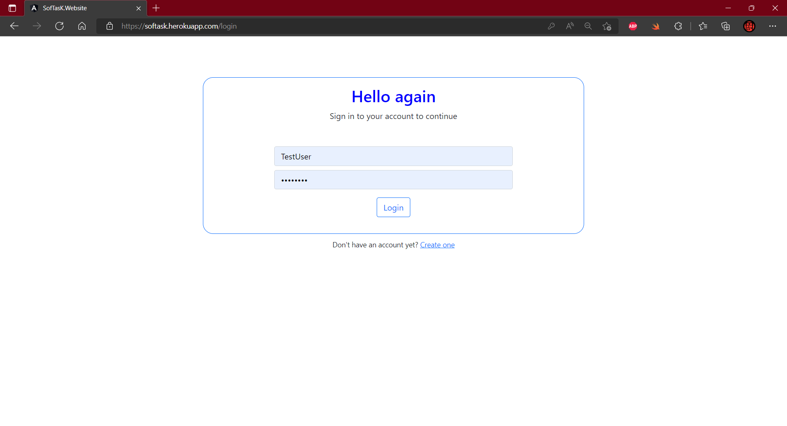
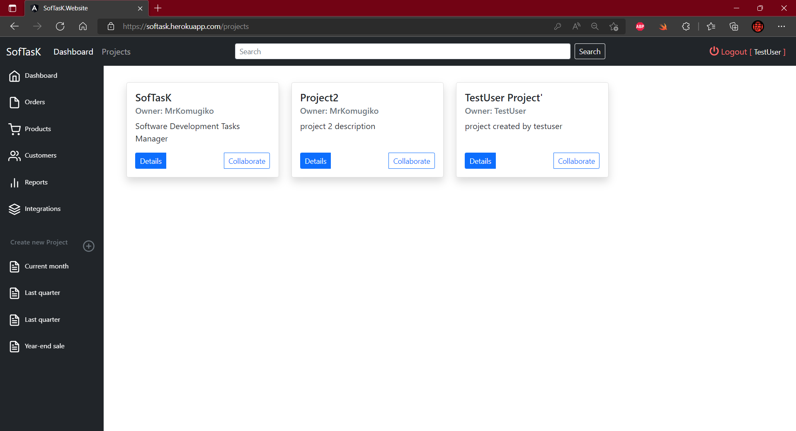
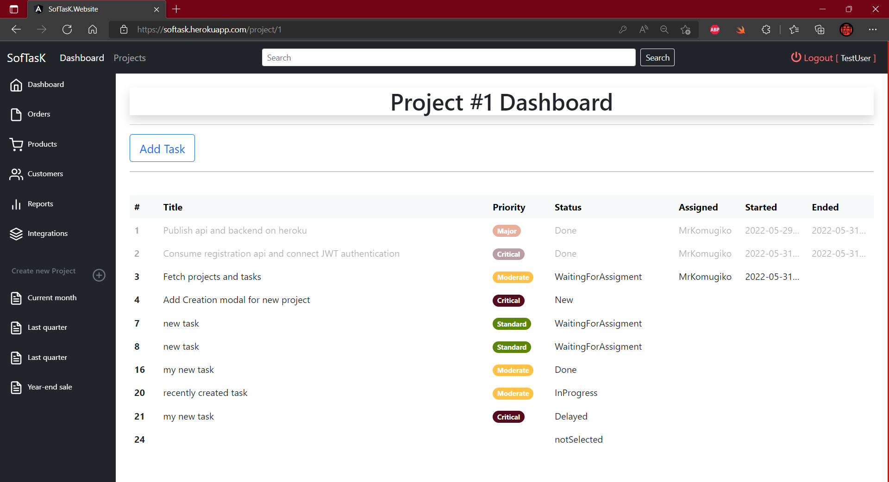
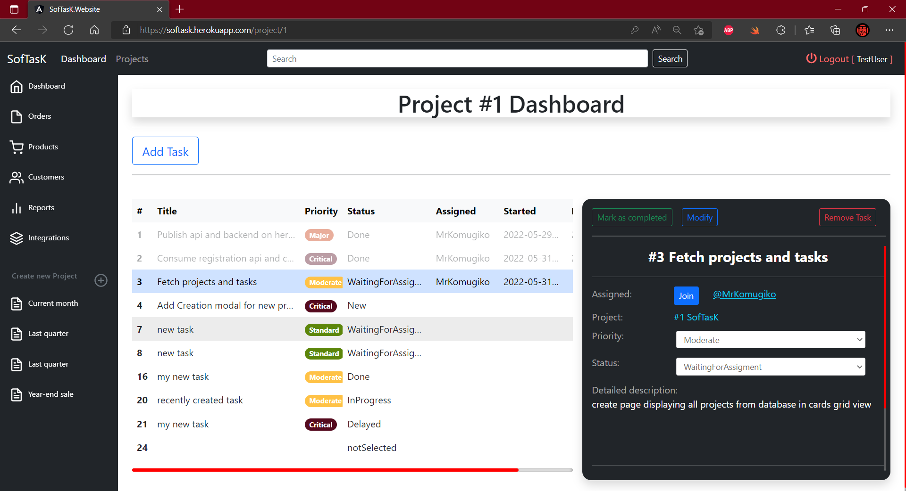
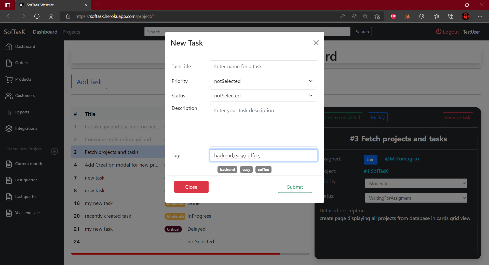

# SofTasK

Projects and task managment app, for tracking and cooperating on projects.

###  Table of Contents  
- [Demo](#demo)  
- [Tech stack - Frontend](#stackfront)
- [Tech stack - Backend](#stackback)    
- [Features](#Features)  
- [Overview (screens)](#screens)  

<a name="demo"/>

## Demo  

| **Website**       | https://softask.herokuapp.com           | 
|:-------------|:-------------| 
| **Login**        | MrKomugiko           | 
| **Password**       | Test123!           | 

**INFO:** *possible interruptions in the availability of the test page due to the cyclical rewriting   
of the Postgress database by the Heroku host and the need to manually refresh the access keys.*  
**INFO** *long time of first login process, caused by turning on webapi from sleepmode  
( free heroku plan turn off applications while not in use longer time ) 

<a name="stackfront"/>

## Tech Stack Frontend

**Language** TypeScript, (+ RxJS library)

**UI** Bootstrap 5 ng-bootstrap

**Framework** Angular

**Hosting** Heroku

<a name="stackback"/>

## Tech Stack Backend

**Language** C#

**Authentication** JWT (+ Identity Asp.Net Core api)

**Framework** .NET 6 + EntityFramework Core, 

**Database** Postgress

**Hosting** Heroku

<a name="Features"/>

## Features
&check; authentication via JWT  
&check; Registration and login  
&check; Acces to all Projects created on server  
&check; Browse projects details  
&check; operations on tasks, adding new, deleting existing  

<a name="screens"/>

## Overwiew - screens

